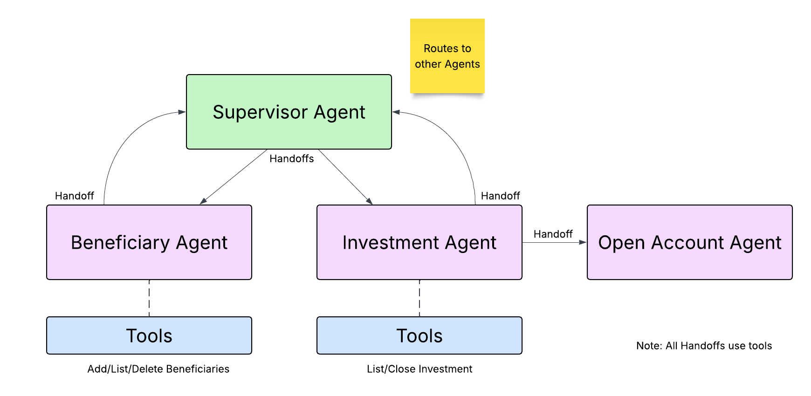

# Wealth Management Agent Example using Vercel AI SDK

A multi-agent wealth-management demo built with the [Vercel AI SDK](https://ai-sdk.dev) and [Temporal](https://temporal.io).

A supervisor agent routes customer requests to specialist sub-agents (beneficiaries, investments, open account). Two flavors are included:

- A **non-Temporal CLI** that runs the same agent loop in a single process — useful for iterating on prompts and tools.
- A **Temporal-integrated** flavor where the agent runs inside a Temporal Workflow as a durable, replayable, long-running conversation. A child workflow handles a multi-step "open new investment account" flow with KYC and compliance checkpoints.



## Prerequisites

- [Node.js 20+](https://nodejs.org/)
- [Temporal CLI](https://github.com/temporalio/cli) (only required for the Temporal flavor)
- [Redis](https://redis.io/) (used by the Temporal flavor for chat history; optionally for the claim-check payload codec)
- A [Google Gemini API key](https://aistudio.google.com/app/apikey)

## Install dependencies

From the project root:

```bash
npm install
```

## Set up your Gemini API key

Create `setllmkey.sh` at the project root with your key:

```bash
export GOOGLE_GENERATIVE_AI_API_KEY="<your-key-here>"
```

`setllmkey.sh` is gitignored. The start scripts source it automatically.

## Getting Started

Pick the flavor you want to run:

- **[ADDK Only CLI](src/vai_supervisor/README.md)** — run the agent using ADK via the command line.
- **[Temporal Version](src/temporal_supervisor/README.md)** — run the durable agent Temporal version
